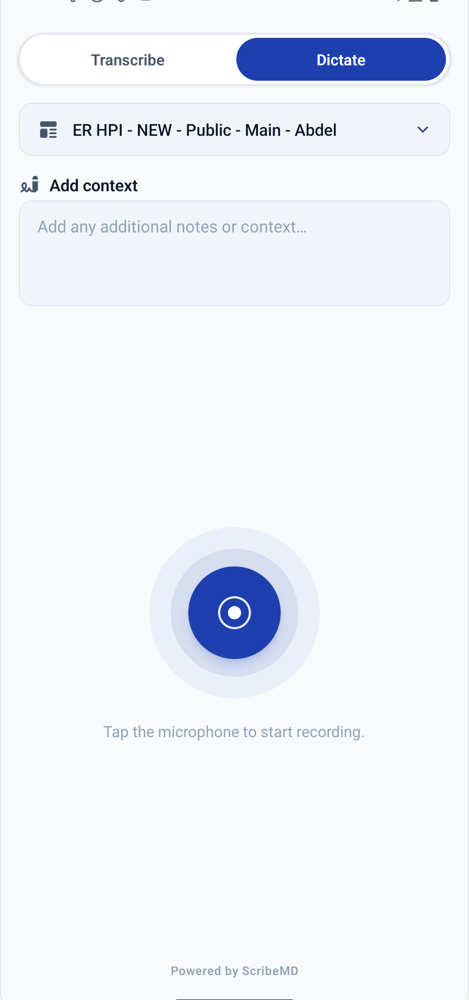
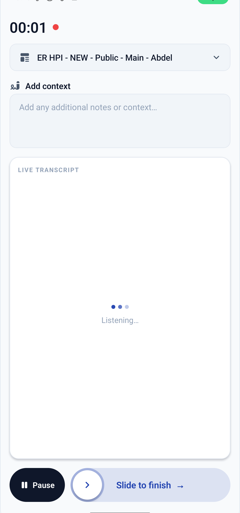

# ScribeMD Mobile SDK

[](https://www.npmjs.com/package/@scribemd-ai/mobile-sdk)
[](./LICENSE)
[](#platforms)

Drop a complete [ScribeMD](https://scribemd.ai) medical scribe into your React Native app — microphone capture, real-time transcription, and AI clinical-note generation — behind **two components** and a single accent color you control.

<p align="center">
  
  &nbsp;&nbsp;
  
</p>

```tsx
import { ScribeMDProvider, ScribeSession } from '@scribemd-ai/mobile-sdk';

<ScribeMDProvider sessionToken={sessionToken}>
  <ScribeSession
    onComplete={({ transcript, note }) => {
      // the generated clinical note is ready — persist or display it
    }}
  />
</ScribeMDProvider>
```

## Features

- 🎙️ **Live transcription** — streams the visit audio and shows the transcript in real time.
- 🧠 **AI clinical notes** — a structured note is generated from the conversation when the session ends.
- 🩺 **Two capture modes** — ambient **Visit** (rolling audio segments) and live **Dictation** (streaming), selectable per session.
- 📴 **Offline-first** — visit audio is journaled to disk and survives process death; an interrupted session is finalized automatically on the next launch.
- ✍️ **In-app note review** — tap-to-edit sections, with an optional TipTap rich-markdown editor (the same engine as the ScribeMD web app).
- 🌍 **Five locales** — English, Hebrew, Arabic, French, Spanish, with automatic RTL layout.
- 🎨 **Themeable** — one accent color themes the whole UI; light and dark supported.
- 📱 **iOS + Android**, bare React Native and Expo, new architecture.

## Install

```sh
npm install @scribemd-ai/mobile-sdk
```

Bare React Native apps also need the Expo Modules API and the file-system peer (used for visit mode + offline recovery):

```sh
npx install-expo-modules@latest
npx expo install expo-file-system
cd ios && pod install
```

See **[INTEGRATION.md](INTEGRATION.md)** for iOS/Android setup, the full prop reference, the error contract, and platform requirements.

## Quick start

1. **Your backend** exchanges a clinician's identity for a one-time **session token** (never ship your API key in the app).
2. **Your app** passes that token to `<ScribeMDProvider>`; it exchanges it once and keeps the resulting credentials **in memory only**.
3. Render `<ScribeSession>` and handle `onComplete`.

```tsx
import { ScribeMDProvider, ScribeSession } from '@scribemd-ai/mobile-sdk';

export function VisitScreen({ sessionToken }: { sessionToken: string }) {
  return (
    <ScribeMDProvider sessionToken={sessionToken}>
      <ScribeSession
        patientContext={{ patientId: '4482' }}
        finishControl={{ label: 'Finish visit' }}
        theme={{ accent: '#1E40AF' }}
        onComplete={({ transcript, note }) => {
          // send `note` to your EHR, or show it for review
        }}
      />
    </ScribeMDProvider>
  );
}
```

Full authentication flow, every prop, and the offline/recovery model are documented in **[INTEGRATION.md](INTEGRATION.md)**.

## Platforms

| Platform | Minimum | Notes |
| --- | --- | --- |
| iOS | per your RN version | Needs `NSMicrophoneUsageDescription`; add the `audio` background mode to keep recording alive when backgrounded. |
| Android | per your RN version | Uses a `microphone`-typed foreground service; the SDK requests `RECORD_AUDIO` at runtime. |

## Development

```sh
bun install        # SDK dependencies
bun run build      # compile TypeScript to build/
bun run lint
```

### Run the example app (bare React Native)

```sh
cd example-bare
bun install
cd ios && pod install && cd ..   # iOS only
bun start                        # Metro
# in another terminal:
bunx react-native run-ios        # or run-android
```

Enter a session token (production path) or a dev API token, plus a patient id, then start a session. The example symlinks the SDK from the repo root, so SDK edits reload live (see `example-bare/metro.config.js` for the required Metro `blockList`).

## License

[Apache-2.0](./LICENSE) © ScribeMD, Inc.
